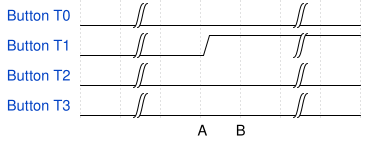
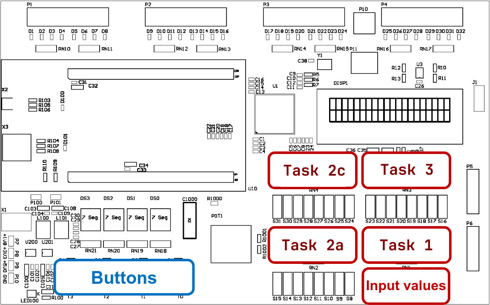

# Bit Manipulations

<!--toc:start-->

- [Bit Manipulations](#bit-manipulations)
  - [Introduction](#introduction)
  - [Learning Objectives](#learning-objectives)
  - [**Task 1:** Control individual
    LEDs](#task-1-control-individual-leds)
  - [**Task 2:** Edge detection](#task-2-edge-detection)
  - [**Task 3:** Add functions for remaining
    buttons](#task-3-add-functions-for-remaining-buttons)
  - [**Task 4 (optional)**](#task-4-optional)
  - [I/O Overview of combined
    programs](#io-overview-of-combined-programs)
  - [Grading](#grading) <!--toc:end-->

## Introduction

In this lab you will learn to use different techniques for the
manipulation of individual bits in registers. You will use these to read
dip switches and buttons, as well as to write out values. Specifically,
you will detect events on the four buttons `T[3..0]`.

## Learning Objectives

- You can apply the bitwise operators in C for setting and clearing
  individual register bits.
- You can explain the purpose of an edge detection and are able to
  implement it in C.
- You know how to use the bit shifting operators in C.

## **Task 1:** Control individual LEDs

Expand the given program so that `LED7..6` are always on (bright) and
`LED[5..4]` are always off (dark). As a result `LED[3..0]` will be
controlled by the settings of DIP switches `SW[3..0]` whereas the state
of the four leftmost DIP switches will be ignored.

> Define (`#define`) a mask for the “bright” as well as for the “dark”
> bits and use the assignment operators `|=` and `&=` to set/clear the
> corresponding bits.

Verify the correct behaviour with different positions of the DIP
switches.

## **Task 2:** Edge detection

1)  Expand the program from [Task 1](#task-1-control-individual-leds).
    Read the state of the buttons `T[3..0]` into a variable, that you
    define. Mask the unused upper four bits. Define an 8 bit wide
    counter variable. Increment this variable each time the button
    `T[0]` is pressed i.e. whenever bit 0 is high. Output the counter
    variable on `LED[15..8]` during each loop iteration.
2)  What do you notice when testing? By which value does the counter
    increase when you press the button? What is the cause?
3)  Expand the program with another counter variable that counts the
    “push events” of the button. Count the push events independent of
    how long the button is pressed by the user. Output the variable on
    `LED[31..24]`. Implement an edge detection, which detects if one or
    more buttons were not pressed (low) during the last loop iteration
    and are now pressed (high).

<figure>

<figcaption aria-hidden="true">edge detection</figcaption>
</figure>

| **A** | **B** | **Z** |
|:-----:|:-----:|:-----:|
|   0   |   0   |   0   |
|   0   |   1   |   1   |
|   1   |   0   |   0   |
|   1   |   1   |   0   |

> - At the end of the loop save the value of the button state in a
>   variable.
> - Implement the edge detection for all four buttons at the same time.
>   You can do this by comparing the last button state with the current.
>   Use the bitwise NOT (`~`) and the AND (`&`), or the bitwise XOR
>   (`^`).
> - Then use a bit mask to test for button T0.

## **Task 3:** Add functions for remaining buttons

Expand your program further. Implement the following functions for the
buttons. Use a variable of type `uint8_t`.

- **Button T3** - The variable shall be assigned to value set on the DIP
  switches `SW[7..0]`
- **Button T2** - The value of the variable shall be inverted bitwise
- **Button T1** - The value of the variable shall be shifted to the left
  by one bit (`<<`)
- **Button T0** - The value of the variable shall be shifted to the
  right by one bit (`>>`)

In the case where more than one button is pressed simultaneously only
one shall be carried out. Continuously output the value of the variable
on `LED[23..16]`.

## **Task 4 (optional)**

Change the program from [Task
3](#task-3-add-functions-for-remaining-buttons), so that only bits
`[5..2]` are inverted when button `T[2]` is pressed. The other bits
shall be left untouched.

> You can toggle a bit with the XOR operation (`^`). Create a mask with
> the bits to toggle set (true).

## I/O Overview of combined programs

In the following depiction you see all in- and outputs of todays tasks.

<figure>

<figcaption aria-hidden="true">In- and output</figcaption>
</figure>

## Grading

The working programs have to be presented to the lecturer. The student
has to understand the solution / source code and has to be able to
explain it to the lecturer.

| **Criteria** | **Weight** |
|:---|:--:|
| [Task 1](#task-1-control-individual-leds) implemented | 1 / 4 |
| [Task 2](#task-2-edge-detection) a) implemented, b) explained | 1 / 4 |
| [Task 2](#task-2-edge-detection) c) implemented | 1 / 4 |
| [Task 3](#task-3-add-functions-for-remaining-buttons) implemented | 1 / 4 |

<!-- links -->
