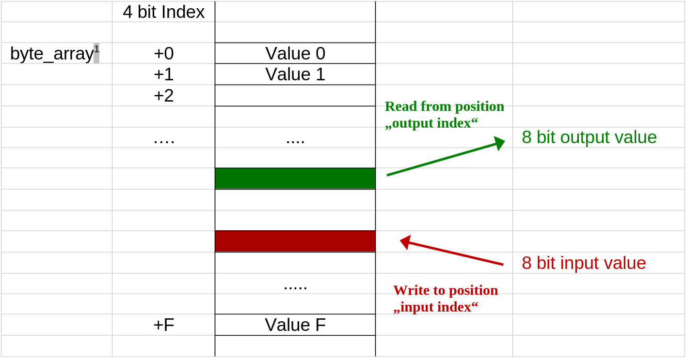
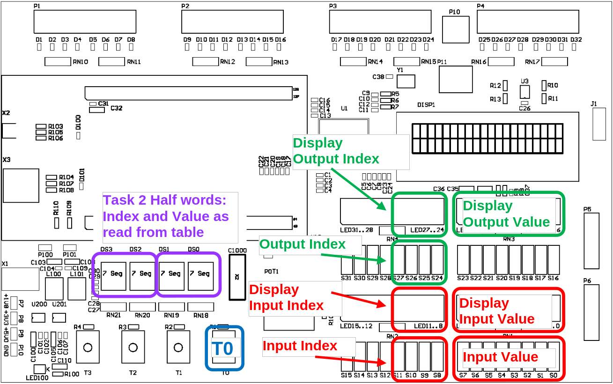
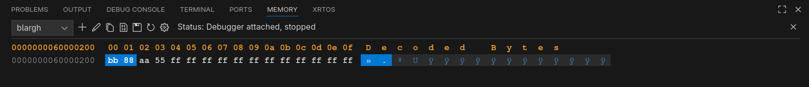

# Data Transfer Instructions

<!--toc:start-->

- [Data Transfer Instructions](#data-transfer-instructions)
  - [Introduction](#introduction)
  - [Learning Objectives](#learning-objectives)
  - [**Task 1** Input and output table
    values](#task-1-input-and-output-table-values)
    - [Given program frame](#given-program-frame)
    - [Read input index and input
      value](#read-input-index-and-input-value)
    - [Store in table](#store-in-table)
    - [Read and display the output
      index](#read-and-display-the-output-index)
    - [Display the selected table
      value](#display-the-selected-table-value)
  - [**Task 2** Variant with halfword
    table](#task-2-variant-with-halfword-table)
  - [Grading](#grading) <!--toc:end-->

## Introduction

In this Lab you will write your first assembly program. The program
reads data from the DIP-switches (of the target hardware) and stores
them in a table. The table elements can be selected through the
DIP-switches and are displayed on the 7-segment display.

## Learning Objectives

Using assembly language you are able

- to input and output data on the CT Board
- to allocate memory to tables
- to access tables with byte elements as well as tables with halfword
  elements

## **Task 1:** Input and output table values

Write an assembly program: Upon every press of button `T0` the program
shall read a 4 bit input index (`SW[11..8]`) and an 8 bit input value
(`SW[7..0]`) from the DIP-switches. The input value shall be stored in a
table in RAM at the position provided by the input index. For debugging,
the input value shall be displayed on `LED[7..0]` (see the figure
below). In addition, the input index shall be displayed on `LED[11..8]`.

<figure>

<figcaption aria-hidden="true">writing and reading value to/from the
table</figcaption>
</figure>

Additionally a table value shall be queried on each turn. The desired
output index can be selected through the DIP-switches `SW[27..24]` and
shall be displayed on `LED[27..24]`. The corresponding table value shall
be displayed on `LED[23..16]`. The picture below shows how the different
values shall be read from or written to the target hardware.

<figure>

<figcaption aria-hidden="true">in- and outputs</figcaption>
</figure>

### Given program frame

Use the given program frame for this lab with the assembly file
*table.s*. It contains a while loop and the subprogram waitForKey, which
gets called with the assembly command `bl`. The subprogram waits until
the user presses button `T0` and then continues. Expand the program step
by step at the marked positions.

### Read input index and input value

In this step you read the input index and the input value, both of which
you need for writing into the table. Read the values for the input index
from the DIP-switches `SW[11..8]` and the input value from `SW[7..0]`.
You can directly read a byte from the corresponding addresses. You have
to mask the upper bits of the input index (i.e. clear the bits to 0)
with the following instructions (**BITMASK_LOWER_NIBBLE** is already
defined in the program frame).

``` asm
    ldr     r7, =BITMASK_LOWER_NIBBLE
    ands    r1, r1, r7
```

Display the values read on `LED[7..0]` and `LED[11..8]`. If a bit is ‘1’
the corresponding LED shall be on. Check whether the masking of the
input index works as intended.

### Store in table

Allocate memory in the data section for a table with 16 bytes (assembly
directive `SPACE`). Be aware of the fact, that the elements are not
initialised when the program starts. Store the previously read input
values at the correct position in the table (input index).

You can test your program by observing your array via the memory view,
see the picture below.

<figure>

<figcaption aria-hidden="true">Debugger Memory View</figcaption>
</figure>

> In case you are using VS Code with the Cortex-Debug extension, note,
> that the view only updates when the program pauses (manually or
> breakpoint).

### Read and display the output index

Read the output index from the DIP-switches `SW[27..24]`. You also have
to mask the upper 4 bits.

Display the index on `LED[27..24]`. Verify the correct behaviour by
trying different positions of the DIP-switches.

> The LEDs are only updated when `T0` is pushed.

### Display the selected table value

Use the output to access the table and display the corresponding value
on `LED[23..16]`.

Verify the correct function of your program by filling the table with
defined values reading afterwards.

## **Task 2:** Variant with halfword table

Adjust your program so that it uses a table of halfwords (16 bits)
instead of bytes. Additionally to the input value (stored in the less
significant byte), the input index shall be stored in the more
significant byte of the table element.

Also display the output index (`DS[3..2]`) and output value (`DS[1..0]`)
on the 7-segment display.

> Since a halfword contains two bytes, you have to multiply the indices
> by two. You can use the `lsls` (‘Logic Shift Left Status’) instruction
> to achieve this.

> Visit the [CT-Wiki](https://ennis.zhaw.ch) to read up on the 7-segment
> display. Use the ‘Binary Interface’ to directly display the values in
> hexadecimal representation.

## Grading

The working programs have to be presented to the lecturer. The student
has to understand the solution and source code and has to be able to
explain it to the lecturer.

| **Criteria**                                                        | **Weight** |
|:--------------------------------------------------------------------|:----------:|
| [Task 1: IO of Table Values](#task-1-input-and-output-table-values) |   2 / 4    |
| [Task 2: Halfword Table](#task-2-variant-with-halfword-table)       |   2 / 4    |

<!-- Links -->
