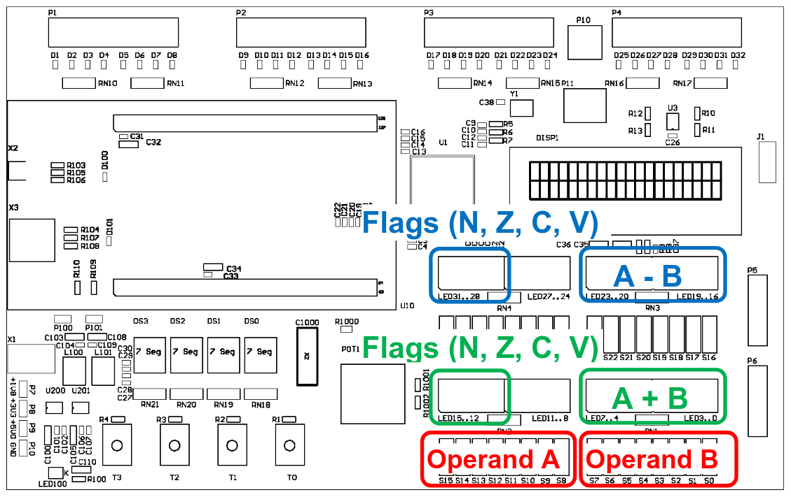
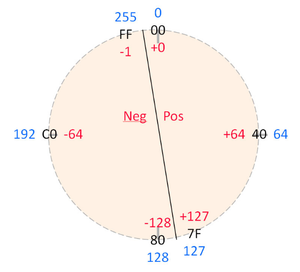
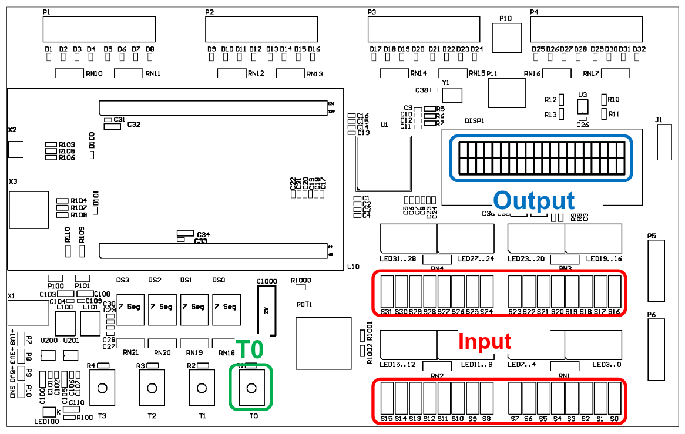

# arithmetic operations

<!--toc:start-->

- [arithmetic operations](#arithmetic-operations)
  - [Introduction](#introduction)
  - [Learning Objectives](#learning-objectives)
  - [**Task 1** Sum and difference](#task-1-sum-and-difference)
    - [Addition](#addition)
    - [Subtraction](#subtraction)
  - [**Task 2** 64 Bit Addition](#task-2-64-bit-addition)
  - [**Task 3 (optional)** Arithmetic
    Commands](#task-3-optional-arithmetic-commands)
  - [Grading](#grading) <!--toc:end-->

## Introduction

In this laboratory you will write your own assembly programs to perform
additions and subtractions on the CT Board.

## Learning Objectives

- You can apply addition and subtraction operations in assembly
  programs.
- You understand the implications of these operations on the processor
  flags.
- You can implement additions, which exceed the word size of the
  processor.

## **Task 1** Sum and difference

> Todays laboratory is structured into three projects. To build each
> project with Makefiles, you need to change into the projects
> directory, or use `make -C <path/to/project> <rule-name>`.

You shall write a program that adds and subtracts two 8 bit values. To
be able to observe the carry and overflow flags, the two 8 bit values
will be shifted to the left by 24 bits to occupy the most significant
eight bits of the register.

Open the given project frame `sum_diff` and expand it, so that one 8 bit
wide value is read from the DIP-switches S15 to S8 (operand A) and
another from S7 to S0 (operand B). Both operands shall be expanded to 32
bit, as mentioned in the introduction. Display the most significant byte
of the sum on LED7 to LED0 and the most significant byte of the
difference on LED23 to LED16.

> The instruction `LSLS` (i.e. `LSLS R1, R1, #24`) shifts the content of
> register R1 to the left by 24 bits. The right part gets filled with
> zeroes. You will learn about the shift instructions in a future
> lesson.

Additionally you shall display the flags set by these two operations on
the LEDs. The flags from the addition shall be displayed on LED15 to
LED12 and the ones from the subtraction on LED31 to LED28 (See the
figure below).

> - To read the processor flags, you can use the `MRS` instruction.
>   i.e.: `MRS R1, APSR` copies the content of the application program
>   status register to register R1.
> - The four flag bits are positioned from bit 31 to bit 28. To display
>   these on the LEDs, you need to shift those bits to the right by 24
>   bits. Use the `LSRS` instruction. i.e.: `LSRS R1, R1, #24` shifts
>   the content of R1 to the right by 24 bits.

<figure>

<figcaption aria-hidden="true">In and output of values for the sum and
difference</figcaption>
</figure>

Before writing your program, calculate the expected results based on the
following table, i.e. sum, difference and flags.

### Addition

| **A**  | **B**  | **Result (A+B)** | **N** | **Z** | **C** | **V** |
|--------|--------|------------------|-------|-------|-------|-------|
| `0x82` | `0x12` | ``               | ``    | ``    | ``    | ``    |
| `0x34` | `0x72` |                  |       |       |       |       |
| `0xC2` | `0x87` |                  |       |       |       |       |
| `0xA3` | `0x62` |                  |       |       |       |       |
| `0x67` | `0x99` |                  |       |       |       |       |

### Subtraction

| **A**  | **B**  | **Result (A-B)** | **N** | **Z** | **C** | **V** |
|--------|--------|------------------|-------|-------|-------|-------|
| `0xEE` | `0x12` | ``               | ``    | ``    | ``    | ``    |
| `0x8E` | `0x72` |                  |       |       |       |       |
| `0x79` | `0x87` |                  |       |       |       |       |
| `0x9E` | `0x62` |                  |       |       |       |       |
| `0x67` | `0x99` |                  |       |       |       |       |

> Note for subtraction: `C = '0'` means ‘borrow’, while `C = '1'` means,
> that ‘borrow’ is not necessary.

Once the tables are completed write the program and compare its output
against the tables.

  
  
  

<figure>

<figcaption aria-hidden="true">number circle</figcaption>
</figure>

## **Task 2** 64 Bit Addition

Extend the provided project `add64` with a 64 bit summation variable
(unsigned interpretation). Every time you press button T0, the program
shall read a 32 bit input value from the DIP-switches and shall add the
read value to the summation variable. The sum shall be displayed
continuously on the LCD display (see the image below).

> Use the binary interface of the LCD display (see page LCD Binary
> Interface on the [CT wiki](https://ennis.zhaw.ch)).

<figure>

<figcaption aria-hidden="true">In- and output for the 64 bit
addition</figcaption>
</figure>

Verify the results of your program, especially the overflow from one
word to the other.

## **Task 3 (optional)** Arithmetic Commands

Assemble, link and load the given project arith_operations with the
debugger. Execute the program step by step. Watch and comprehend the
changes in the registers and flags.

## Grading

The working programs have to be presented to the lecturer. The student
has to understand the solution / source code and has to be able to
explain it to the lecturer.

| **Criteria**                                           | **Weight** |
|:-------------------------------------------------------|:----------:|
| The program meets the requirements described in Task 1 |   2 / 4    |
| The program meets the requirements described in Task 2 |   2 / 4    |

<!-- links -->
