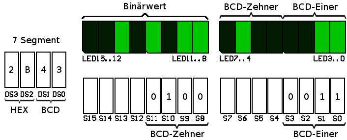
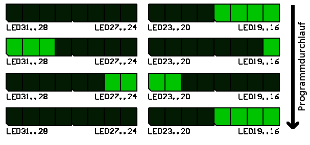

# ALU and Branch Instructions

<!--toc:start-->
- [ALU and Branch Instructions](#alu-and-branch-instructions)
  - [Introduction](#introduction)
  - [Learning Objectives](#learning-objectives)
  - [**Task 1:** BCD to binary](#task-1-bcd-to-binary)
  - [**Task 2:** Chasing light](#task-2-chasing-light)
  - [**Task 3 (optional):** Validate BCD input](#task-3-optional-validate-bcd-input)
  - [Grading](#grading)
<!--toc:end-->

## Introduction

An **A**rithmetic **L**ogic **U**nit (ALU) can perform add, multiply,
shift, rotate and compare operations.
You have already used some of these operations in previous
laboratories.
In this lab you will learn to use additional ALU operations as well
as branch instructions.

Implement a program for the conversion of BCD values into binary
values.
The numbers will be displayed in various ways.

## Learning Objectives

* You can apply logical, arithmetic and shift instructions.
* You can implement a multiplication with the `muls` instruction as
  well as with a combination of `shift` and `add` instructions.
* You can compare values with each other and apply corresponding
  branch instructions.

## **Task 1:** BCD to binary

Use the provided project `bcd`.
Read a BCD input from the DIP-switches.
The switches `SW[3..0]` shall contain the ones and the switches
`SW[11..8]` shall contain the tens.
The two digits shall be combined, so that the BCD value can be
displayed on `LED[7..0]` and the corresponding binary value on
`LED[15..8]`.
Additionally the BCD value shall be displayed on the 7-segment
display `DS[1..0]` and the HEX value on `DS[3..2]`.

For this lab we assume the user only enters valid BCD codes.
The program does not have to validate the input.

First implement the program using the `muls` instruction for the
multiplication by 10.

Once this works, expand your program by a manual implementation of
the multiplication using only **shift** and **add** instructions.
While button T0 is pressed use the manual multiplication algorithm
and set the background of the LCD to **red**.
Otherwise use the `muls` implementation and set the LCD background
to **blue**.

> There are special addresses for accessing the display with binary
> values.
> Check the [CT Board Wiki](https://ennis.zhaw.ch) for the binary
> interface of the 7-segment displays.

## **Task 2:** Chasing light

Expand your program, so that the total number of set bits (`1`) in
the **binary** value is represented as a bar on the LEDs.

* *First* just display a static bar of active LEDs on `LED[31..16]`.
  The width of the bar from the right shall correspond to the number
  of LEDs that are turned on for `LED[15..8]`.
  I.e. the width of the LED bar corresponds to the number of ones in
  the binary value.

* *Second* make this LED bar rotate (see Figure below).
  The direction of the rotation shall be from left to right.
  Ones that "fall out" on the right side shall re-enter on the left
  side.
  Pause after every shift operation, so that the rotation is visible.

> * Use the predefined subroutine for your pause.
>   It can be called using `bl pause`.
>   This subroutine does not change relevant registers.
> * LED31..LED16 are aligned to a half word address.
>   Use `strh` for updating to avoid overwriting any other registers.
> * The processors instruction for rotating only operate on 32 bit
>   registers.
>   To circumvent this problem, have two copies of the light bar in
>   the register to display.
>   This works, because the instruction operates on an integer
>   multiple of the length of our display.

## **Task 3 (optional):** Validate BCD input

Verify the validity of the value entered on the DIP switches.
If the value is invalid all LEDs shall be turned off.

## Grading

The working programs have to be presented to the lecturer.
The student has to understand the solution / source code and has to
be able to explain it to the lecturer.

+-------------------------------------------------------+---------------+
| **Criteria**                                          | **Weight**    |
+:======================================================+:=============:+
| The program meets the requirements of                 | 2/4           |
| [Task 1](#task-1-bcd-to-binary).                      |               |
+-------------------------------------------------------+---------------+
| The program meets the requirements of                 | 2/4           |
| [Task 2](#task-2-chasing-light).                      |               |
+-------------------------------------------------------+---------------+
