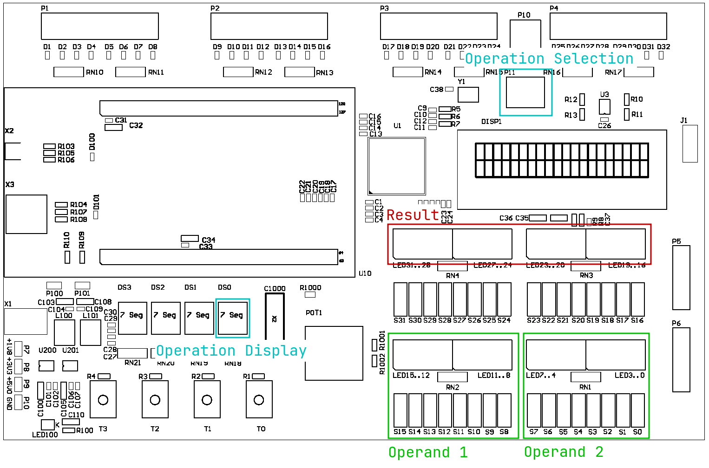

# Control Structures

<!--toc:start-->

- [Control Structures](#control-structures)
  - [Introduction](#introduction)
  - [Learning Objectives](#learning-objectives)
  - [Task 1](#task-1)
  - [Grading](#grading) <!--toc:end-->

## Introduction

In this lab you will implement a simple calculator on the target
hardware. The operands can be entered through the dip switches and the
operation can be selected through the rotary switch.

## Learning Objectives

- you can implement a switch-case statement with a jump table in
  assembly
- you strengthen your skills in the application of arithmetic and logic
  instructions

## Task 1

Implement a program, which reads 8-bit values from the DIP-switches and
performs different operations on them. The result shall be displayed on
the LEDs. Use the given project frame.

> - Read the comments in the given program frame. They will show you
>   where to enter your code.
> - Implement the switch-case statement based on the lecture slides.

The program shall meet the following requirements (See Table 1, Figure
1):

- The first operand (op1) shall be entered through the DIP-switches S15
  to S8.
- The second operand (op2) shall be entered through the DIP-switches S7
  to S0.
- The 8 bit operands shall be zero-extended to 32 bit.
- The operation shall be selected through the rotary switch, according
  to Table 1.
- The position of the rotary switch shall be displayed on the 7-segment
  display. The operands 1 and 2 shall be displayed on LED15 to LED0
  (above the corresponding DIP-switches).
- The 16 bit result shall be displayed on LED31 to LED16.
- A logical “1” shall mean that the corresponding LED is on.
- The program shall use a jump table.

| **Hex-Switch** | **Operation**         |
|---------------:|:----------------------|
|           0x00 | all 16 LEDs off       |
|           0x01 | op1 + op2             |
|           0x02 | op1 - op2             |
|           0x03 | op1 \* op2 (unsigned) |
|           0x04 | op1 & op2 \> AND      |
|           0x05 | op1 \| op2 \> OR      |
|           0x06 | op1 ^ op2 \> XOR      |
|           0x07 | !op1 \> NOT           |
|           0x08 | !(op1 & op2) \> NAND  |
|           0x09 | !(op1                 |
|           0x0A | !(op1 ^ op2) \> XNOR  |
|           0x0B | all 16 LEDs on        |
|           0x0C | all 16 LEDs on        |
|           0x0D | all 16 LEDs on        |
|           0x0E | all 16 LEDs on        |
|           0x0F | all 16 LEDs on        |

<figure>

<figcaption aria-hidden="true">in- and output of operands, operation and
result</figcaption>
</figure>

## Grading

The working program has to be presented to the lecturer. The student has
to understand the solution/source code and has to be able to explain it
to the lecturer.

| **Criteria**                                  | **Weight** |
|:----------------------------------------------|:----------:|
| The program meets the required functionality. |   4 / 4    |
