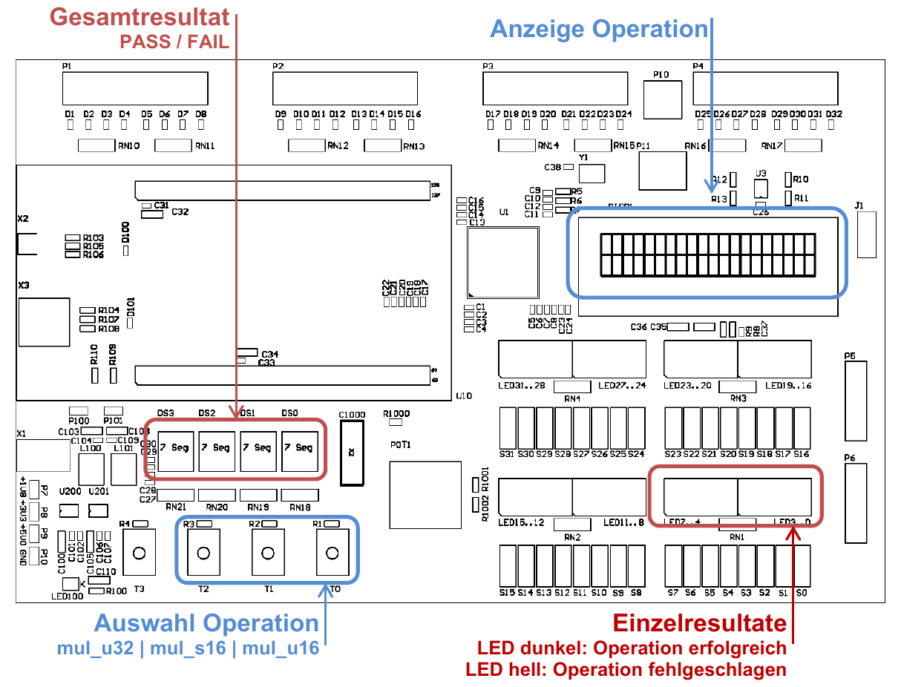

# Multiplication

<!--toc:start-->

- [Multiplication](#multiplication)
  - [Introduction](#introduction)
  - [Learning Objectives](#learning-objectives)
  - [Principle of Long
    Multiplication](#principle-of-long-multiplication)
  - [Project Frame](#project-frame)
  - [**Task 1:** Unsigned 16 bit
    multiplication](#task-1-unsigned-16-bit-multiplication)
  - [**Task 2:** Signed 16 bit
    multiplication](#task-2-signed-16-bit-multiplication)
  - [**Task 3:** Unsigned 32 bit
    multiplication](#task-3-unsigned-32-bit-multiplication)
  - [Grading](#grading) <!--toc:end-->

## Introduction

Remember the long multiplication from grade school? Computers do
basically the same thing, just translated to binary math and optimised
for digital computing.

## Learning Objectives

- In this laboratory you learn, how binary multiplication is
  implemented.
- You will implement the algorithm in assembly.

## Principle of Long Multiplication

For binary Multiplication it is important to know the number of digits
of the result. This is especially true, when multiplying negative
numbers, which are represented in two’s complement.

The length of the output of a multiplication can be determined by adding
the lengths of the inputs. This holds true regardless of the
calculations radix and can be tested quite easily. In a decimal system
for example the highest number with two digits is `99`. The maximum
product of two digit numbers is therefore $`99 \times 99 = 9'801`$. We
can repeat this experiment for a two and three digit number:
$`99 \times 999 = 98'901`$.

But what is multiplication? Let us take a look at the following example:
$`3 \times 12`$. It means that we add twelve three times. This is
already a method to implement multiplication.

This method is not very practical for bigger numbers as the number of
algorithm iterations (order) depends on the value of the multiplier. The
order of long multiplication only depends on the number of digits of the
multiplier, which scales a lot slower and can be implemented in hardware
for single cycle multiplication.

Here is an example for $`23 \times 74`$:

        23 * 74
        -------
            222
           148
           ----
           1702
           ====

The same multiplication with binary numbers:

        10111 * 1001010
        ---------------
                1001010
               1001010
              1001010
             0000000
            1001010
            -----------
            11010100110
            ===========

This is much simpler in the binary system, as there are only the digits
`0` and `1`, i.e. the multiplicand only needs to be added if the
corresponding digit of the multiplier is `1`, otherwise the addition can
be omitted.

## Project Frame

You shall implement algorithms for multiplying **unsigned 16 bit**
values, **signed 16 bit** values and **unsigned 32 bit** values. The
provided program contains a file for each implementation, which also
provides a unit test for your function. The test reads testvalues from a
table and compares the calculated result against a reference value. If
all tests pass the 7 segment display will show `PASS`, otherwise it will
show `FAIL`.

The desired operation can be chosen with the buttons `T[0..2]`. The LCD
displays the operation executed last, the LEDs show which test values
failed.

<figure>

<figcaption aria-hidden="true">Overview of Input and Output</figcaption>
</figure>

## **Task 1:** Unsigned 16 bit multiplication

You first task is to implement a function to multiply two unsigned 16
bit operands. The operands are passed in registers `r0` and `r1`. The
result shall be returned in register `r0`. Follow these steps.

1)  Take a look at the unit test. What does it do?
2)  Run the program. Since the multiplication is not implemented yet,
    the 7 segment display will show `FAIL` and the LEDs will indicate
    the failed calculations.
3)  Insert a `muls` instruction in the function `operation` and confirm,
    that the test passes. The LEDs should remain dark.
4)  Now write your own implementation for multiplication, using shift
    and add operations. Test your implementation and ensure it passes
    the test.

> At this point you should know, how to call functions in assembly, in
> case the lectures have not yet covered this topic, here is an example:
>
> `bl <function_name>`

## **Task 2:** Signed 16 bit multiplication

For this task you shall implement a function to multiply two signed 16
bit numbers. You can copy your implementation from [Task
1](#task-1-unsigned-16-bit-multiplication) and modify it to work with
signed numbers. Insert your code at the marked location in `mul_s16.s`
and test your program.

> - The sign extension of the input values can be achieved with the
>   instruction `SXTH`.
> - The signed multiplication requires 32 loop iterations.

## **Task 3:** Unsigned 32 bit multiplication

Now implement the multiplication of unsigned 32 bit values. Insert your
code in the function `operation` in `mul_u32.s`. The result can require
more than 32 bits, thus you need two registers to store the result. Test
your code and ensure it passes the test.

## Grading

| **Criteria** | **Weight** |
|:---|:--:|
| The program meets the requirements of [Task 1](#task-1-unsigned-16-bit-multiplication). | 2/4 |
| The program meets the requirements of [Task 2](#task-2-signed-16-bit-multiplication). | 1/4 |
| The program meets the requirements of [Task 3](#task-3-unsigned-32-bit-multiplication). | 1/4 |
