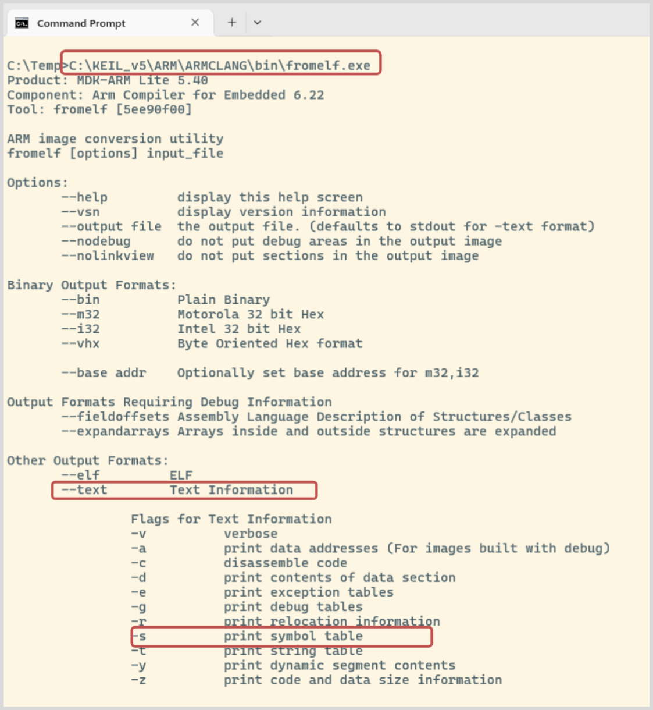

# Linker

<!--toc:start-->

- [Linker](#linker)
  - [Introduction](#introduction)
  - [Learning Objectives](#learning-objectives)
  - [**Task 1** Interpreting compiler and linker
    errors](#task-1-interpreting-compiler-and-linker-errors)
    - [Keil workflow](#keil-workflow)
    - [Makefile workflow](#makefile-workflow)
  - [**Task 2:** Debugging](#task-2-debugging)
    - [Keil workflow](#keil-workflow-1)
    - [Makefile workflow](#makefile-workflow-1)
  - [**Task 3:** Analysing symbols](#task-3-analysing-symbols)
    - [Keil workflow](#keil-workflow-2)
    - [Makefile workflow](#makefile-workflow-2)
  - [**Task 4:** Linker map](#task-4-linker-map)
    - [Keil workflow](#keil-workflow-3)
    - [Makefile workflow](#makefile-workflow-3)
  - [Grading](#grading) <!--toc:end-->

## Introduction

In this lab, you will learn how to fix errors that occur when using
external libraries and how to configure the debugger so that it can step
into library functions. Additionally, you will learn how to interpret
the output files created by the assembler/compiler and linker.

The project consists of a library along with the corresponding header
files. You must specify the correct locations of the header files in the
makefile and add any missing `#include` directives in `main.c`.
Furthermore, you need to specify the library to use in the linker
options.

After that, you will debug the program. You will learn the difference
between libraries with and without debug symbols.

> This laboratory differs significantly between the workflow with
> **Keil** and the workflow with **Makefile** (VS Code uses the
> Makefiles). Make sure to follow the instructions for your workflow.

## Learning Objectives

- You can interpret error messages from the compiler and linker and fix
  the problems.
- You use external libraries.
- You can extract the symbols from elf files and interpret the output.
- You can interpret linker map files.

## **Task 1** Interpreting compiler and linker errors

Your first task is to make the program compile. Try building the program
and interpret the compiler/linker error messages to locate the problem.

Also see the task list in `main.c`.

> This application is not just divided into modules, but also a library,
> whose headers can be found in the directory `inc`. You need to tell
> your toolchain where to look for the headers.
>
> You also need to tell the toolchain what libaries to link against and
> where to find them.

See the chapters below for workflow specific instructions.

Once you fixed all errors, you can flash the program to the CT board.
The functionality is quite simple: Pressing the button T0 inverts the
LEDs. On the first activation, the LEDs are set to a predefined pattern.

### Keil workflow

Add the path to the include files in the project settings under the tab
`C/C++`.

Configure the library paths and names under the tab `linker` in the
project settings in the field `Misc Controls`.

### Makefile workflow

To add the include path, extend the variable `INC_DIR`.

In order to fix the linker error, you first need to build the library.
Use the makefile in the directory `libctio` to build an archive with
`make rebuild`. Follow the example of `libctboard` to add `libctio` to
the linker command.

> Add elements to a variable with `key += value`. Explore the file
> `<ct-root-directory>/common/root.mk` to understand how the variables
> `LIB_PATHS` and `LIB_NAMES` are used in the linker command.

> Note that GCC automatically adds a ‘lib’ to library names.

## **Task 2:** Debugging

Try to step through the program line by line with the debugger. Observe
the behaviour of the debugger on functions (`read8`, `write8`,
`toggle`).

### Keil workflow

> Use the button `Step`, or the function key `F11` to step through the
> program line by line.

First debug the program linked against `lib\read_write.lib`. What do you
observe?

  
  
  
  

Now link the program against `lib_debug\read_write.lib` (change the
entry in the `Misc Controls` field in the linker tab). Do not forget to
rebuild the program. What changed?

At last link the program against `lib_debug_with_src\read_write.lib`.
After you started the debugger you need to tell it, where to find the
sources. To do so, enter the following command in the debuggers *command
window*.

`set src = C:\<path-to-laboratory>\keil\lib_debug_with_src`

Keil can not handle spaces in the path, if your user name contains
spaces, you will need to relocate the laboratory to a directory with no
spaces in its path.

What do you observe and what is the cause for the different behaviour?

  
  
  
  
  

### Makefile workflow

> If using `GDB` directly use the command `step` or `s` to debug the
> program line for line.
>
> An empty command (just hitting enter) will execute the last used
> command.

Make sure you built `libctio` without debug symbols (make targets `all`,
`build` or `rebuild` in directory `libctio/`). Rebuild your program
(`make rebuild` in current directory).

Debug the program and document your observation.

  
  
  
  

Now recompile the library (libctio) with debug symbols. Use the make
target `debug` in the directory `libctio/`. Do not forget to rebuild
your program.

Debug the program. What changed and what is the cause for the different
behaviour?

  
  
  
  
  

## **Task 3:** Analysing symbols

For this task you will analyse the symbols of object files and binaries.

### Keil workflow

The tool `fromelf.exe` can print the contents of ELF (executable and
linkable format) files in a human readable format. Object (`.o`) and
library (`.lib`) files and binaries (`.axf`) are all ELF files.



Extract the symbol table from `Objects\toggle.o`, `Objects\main.o` and
`lib\read_write.lib`. Ignore the debug information and focus code and
data symbols.

What attributes indicate that a symbol is local, exported or imported?
Insert your answers in the table below.

<table style="width:99%;">
<colgroup>
<col style="width: 32%" />
<col style="width: 32%" />
<col style="width: 32%" />
</colgroup>
<thead>
<tr>
<th style="text-align: left;"><strong>local symbols</strong></th>
<th style="text-align: left;"><strong>imported symbols</strong></th>
<th style="text-align: left;"><strong>exported symbols</strong></th>
</tr>
</thead>
<tbody>
<tr>
<td style="text-align: left;"><code></code><br />
<code></code><br />
<code></code><br />
<code></code><br />
<code></code><br />
<code></code><br />
<code></code></td>
<td style="text-align: left;"><code></code><br />
<code></code><br />
<code></code><br />
<code></code><br />
<code></code><br />
<code></code><br />
<code></code></td>
<td style="text-align: left;"><code></code><br />
<code></code><br />
<code></code><br />
<code></code><br />
<code></code><br />
<code></code><br />
<code></code></td>
</tr>
</tbody>
</table>

If you miss the header files for a library, could you write the headers
yourself with the extracted symbol table?

  
  
  
  
  
  
  

### Makefile workflow

The tool `arm-none-eabi-readelf` can print the contents of ELF
(executable and linkable format) files in a human readable format.
Object (`.o`) and library files (`.a`) and binaries (`.axf`) are all ELF
files.

Use the command below to extract the symbol tables from the files
`obj/main.o`, `obj/toggle.o` and `libctio/libctio.a`.

``` sh
arm-none-eabi-readelf -s <path/to/elf>

# example
arm-none-eabi-readelf -s obj/main.o
```

What attributes indicate that a symbol is local, exported or imported?
Insert your answers in the table below.

<table style="width:99%;">
<colgroup>
<col style="width: 32%" />
<col style="width: 32%" />
<col style="width: 32%" />
</colgroup>
<thead>
<tr>
<th style="text-align: left;"><strong>local symbols</strong></th>
<th style="text-align: left;"><strong>imported symbols</strong></th>
<th style="text-align: left;"><strong>exported symbols</strong></th>
</tr>
</thead>
<tbody>
<tr>
<td style="text-align: left;"><code></code><br />
<code></code><br />
<code></code><br />
<code></code><br />
<code></code><br />
<code></code><br />
<code></code><br />
<code></code></td>
<td style="text-align: left;"><code></code><br />
<code></code><br />
<code></code><br />
<code></code><br />
<code></code><br />
<code></code><br />
<code></code><br />
<code></code></td>
<td style="text-align: left;"><code></code><br />
<code></code><br />
<code></code><br />
<code></code><br />
<code></code><br />
<code></code><br />
<code></code><br />
<code></code></td>
</tr>
</tbody>
</table>

If you miss the header files for a library, could you write the headers
yourself with the extracted symbol table?

  
  
  
  
  
  
  

## **Task 4:** Linker map

The linker command we use, instructs the linker to generate a map file.

### Keil workflow

Analyse the map file. Explain the memory map using the map file. Search
for the ‘memory map’ section. Where is the vector table, data,
constants, code, etc. located?

  
  
  
  
  
  
  
  
  
  
  

### Makefile workflow

Analyse the map file. Explain the memory map using the map file. Search
for the ‘memory map’ section. Where is the vector table, data,
constants, code, etc. located?

  
  
  
  
  
  
  
  
  
  
  

## Grading

The working programs have to be presented to the lecturer. The student
has to understand the solution / source code and has to be able to
explain it to the lecturer.

| **Criteria** | **Weight** |
|:---|:--:|
| [Task 1](#task-1-interpreting-compiler-and-linker-errors) completed. program compiles and behaves as described | 1/4 |
| Student answered the questions and is able explain their answers for [Task 2](#task-2-debugging). | 1/4 |
| Student answered the questions and is able explain their answers for [Task 3](#task-3-analysing-symbols). | 1/4 |
| Student answered the questions and is able explain their answers for [Task 4](#task-4-linker-map). | 1/4 |

<!-- links -->
