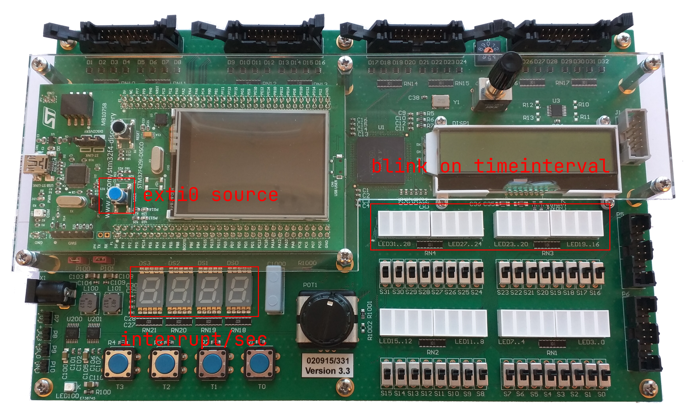

# Interrupts

<!--toc:start-->

- [Interrupts](#interrupts)
  - [Introduction](#introduction)
  - [Learning Objectives](#learning-objectives)
  - [**Task 1** User button interrupt](#task-1-user-button-interrupt)
    - [Vector table lookup for EXTI0](#vector-table-lookup-for-exti0)
    - [Enable the interrupt line for
      EXTI0](#enable-the-interrupt-line-for-exti0)
    - [Implement the interrupt handler for
      EXTI0](#implement-the-interrupt-handler-for-exti0)
    - [Display counter](#display-counter)
  - [**Task 2** Timer interrupt](#task-2-timer-interrupt)
    - [Vector table lookup for TIM2](#vector-table-lookup-for-tim2)
    - [Enable the interrupt line for
      TIM2](#enable-the-interrupt-line-for-tim2)
    - [Implement the interrupt handler for
      TIM2](#implement-the-interrupt-handler-for-tim2)
    - [Adjust main loop](#adjust-main-loop)
  - [Grading](#grading) <!--toc:end-->

## Introduction

In this laboratory you will use interrupts. You will program the user
button of the discovery board (blue button) as manual interrupt source,
which increments a counter. The counter is displayed and reset at a
timeinterval implemented as another interrupt caused by a timer.

<figure>

<figcaption aria-hidden="true">input &amp; output</figcaption>
</figure>

## Learning Objectives

- You can implement an interrupt service routine (handler function).
- You can enable the correct interrupt line for interrupt sources.
- You understand how to use interrupts to handle external events.

## **Task 1** User button interrupt

The program shall count the number of times, the user button is pressed.

### Vector table lookup for EXTI0

Before one can use interrupts, they need to be enabled. Look up the
vectortable to find the interrupt number to enable and the symbol (name)
of the interrupt handler function. Open the file
`../../libctboard/device/source/startup.s` and have a look at the
interrupt vector table.

> ***Sidenote:*** With ARM architectures the interrupt controller
> resides in the processor (rather than being a peripheral around it),
> thats why the address is quite different from other peripherals.

The provided program frame configures the GPIO (general purpose i/o) as
source for the interrupt line `EXTI0`.

What is the symbol (in this case function name) of the associated
handler?

\>\
\>\
\>

What is the corresponding interrupt request number (IRQn)? You can
either count entries in the vector table, or look up the table in the
microcontrollers (`STM32F429ZI`) reference manual online, which has a
column with the irq numbers.

\>\
\>\
\>

### Enable the interrupt line for EXTI0

Now open the provided program frame and enable the interrupt line for
EXTI0 by manipulating the register `SETENAx`.

> Refer to the lecture slides on the topic `Exceptional Control Flow`
> and the page on the
> [NVIC](https://ennis.zhaw.ch/wiki/doku.php?id=stm32:peripherals:nvic)
> on the [CT wiki](https://ennis.zhaw.ch).

### Implement the interrupt handler for EXTI0

Now implement a simple handler function with the before determined
symbol as label/function name. Reset the interrupt request flag within
the handler. Use the provided function `clear_IRQ_EXTI0` to do so.

> Since the vector table does not reside in `main.s` you have to export
> the handlers symbol with the directive `.global <symbol>`.

Set a breakpoint at the start of your interrupt handler and test, that
it is called when activating the user button.

Then extend your handler function by a counter, that is increased on
every call. Define a variable in the given section `.my_var` to store
the counter value. Keep the call to `clear_IRQ_EXTI0` at the end of your
handler.

### Display counter

Extend the main loop and display the current counter value on the seven
segment display.

> You can display the value directly through the binary interface of the
> seven segment display driver (see [CT
> wiki](https://ennis.zhaw.ch/wiki/doku.php?id=ctboard:peripherals:7segment)).

## **Task 2** Timer interrupt

Next, we want to determine the number of interrupts (`EXTI0`) during the
set timer interval (2 seconds).

The handler for `EXTI0` stays the same, but the handler for the timer
interrupt shall copy the counter value to a second variable and reset
the counter.

### Vector table lookup for TIM2

Open the file *startup.s* again and extract the symbol and number for
the handler for interrupt TIM2.

What is the symbol of the handler for TIM2?

\>\
\>\
\>

What is the interrupt line number corresponding to TIM2?

\>\
\>\
\>

### Enable the interrupt line for TIM2

Adjust the code added [earlier](#enable-the-interrupt-line-for-exti0) to
enable both interrupts for EXTI0 and TIM2.

### Implement the interrupt handler for TIM2

Implement a handler function for TIM2 analogous to EXTI0. Toggle the
LEDS 15..0 to visualise the timer interval. Use the function
`clear_IRQ_TIM2` to reset the interrupt request flag.

Build and flash the program and verify the LEDS blink in an interval of
approximately two seconds.

Now define a second variable in the section `.my_var` to store a copy of
the counter value. Load the counter value and store it in the second
variable, then reset the counter to 0.

### Adjust main loop

Change the main loop to display the copy of the counter instead of the
counter itself.

## Grading

The working programs have to be presented to the lecturer. The student
has to understand the solution / source code and has to be able to
explain it to the lecturer.

| **Criteria** | **Weight** |
|:---|:--:|
| The program meets the requirements of [Task 1](#task-1-user-button-interrupt). | 1/4 |
| The program meets the requirements of [Task 2](#task-2-timer-interrupt). | 3/4 |

<!-- links -->
