# CT1 with GNU assembly syntax

> Do **not** fork the repository, see `../readme.(md|pdf)` for
> instructions on how to setup a private remote repository to work with.

**If you choose to work with Keil, skip this document.**

<!--toc:start-->

- [CT1 with GNU assembly syntax](#ct1-with-gnu-assembly-syntax)
- [Installing the required tools](#installing-the-required-tools)
  - [Linux](#linux)
  - [MacOS](#macos)
    - [Git and Make](#git-and-make)
    - [Cloning the Lab Files](#cloning-the-lab-files)
    - [Visual Studio Code](#visual-studio-code)
    - [ARM cross toolchain](#arm-cross-toolchain)
    - [OpenOCD](#openocd)
  - [Windows](#windows)
    - [Installing MSYS2](#installing-msys2)
    - [Installing Visual Studio Code](#installing-visual-studio-code)
    - [Installing tools via MSYS2](#installing-tools-via-msys2)
    - [Git for Windows](#git-for-windows)
- [Testing setup](#testing-setup)
- [Workflow with Makefile](#workflow-with-makefile)
  - [Debugging with `GDB`](#debugging-with-gdb)
- [Workflow with Visual Studio Code](#workflow-with-visual-studio-code)
  - [Debugging with Visual Studio
    Code](#debugging-with-visual-studio-code) <!--toc:end-->

# Installing the required tools

The CT1 laboratories can be done on the operating system of choice, as
long as the following tools are available:

- [Git](https://git-scm.com/)
- [Bash](https://en.wikipedia.org/wiki/Bash_(Unix_shell))
- [GNU Make](https://www.gnu.org/software/make/make.html)
- [openocd](https://openocd.org/pages/getting-openocd.html)
- [arm-none-eabi
  toolchain](https://gitlab.arm.com/tooling/gnu-toolchains-for-arm)

One can choose to use the Makefile for flashing and debugging, or an
integrated workflow with an IDE. See section [Setup Visual Studio
Code](#installing-visual-studio-code) for a guide on how to setup visual
studio code as IDE for the labs.

> Authors choice is Makefiles and GDB, as IDEs are big in scale and
> therefore harder to debug and automate and are prone to
> vulnerabilities.

## Linux

`git`, `bash` and `make` (GNU Make) are packaged and/or shipped with the
base system for all common purpose distributions, so one can just use
the systems package manager to install `git`, `bash` and `make`. If one
uses a distribution, that does not come with these tools preinstalled
and does not provide packages, the path of pain was chosen
deliberately..

`openocd` is relatively popular and thus packaged on many linux
distributions. If your system does not provide a binary package, you can
follow the instructions on its
[website](https://openocd.org/pages/getting-openocd.html) or if the
website is not reachable try the [official
repository](https://sourceforge.net/p/openocd/code/ci/master/tree/).

Make sure your user is in group `dialout` (for Debian, or Fedora based
distributions) or `uucp` (for Arch based distributions). This is
required to give your user access to serial devices. Use the command
below to add your user to group.

**Do not forget `-a`! It stands for ‘append’ and without it, you will
overwrite your users groups!**

``` sh
sudo usermod -aG <group> <user>

# example:
# ($USER is a variable which expands to your username)
sudo usermod -aG dialout $USER
```

> *Note:* If installing from sources, one might need to manually install
> udev rules.

The `arm-none-eabi toolchain` is available as one or multiple packages
on many popular distributions like Arch, Debian and Fedora. If the
toolchain is not packaged, one can download the binaries from [ARMs
download page](https://gitlab.arm.com/tooling/gnu-toolchains-for-arm),
ensure to download the one with `arm-none-eabi` in the name. The path to
the downloaded binaries needs to be added to the PATH variable, in order
for bash to find the executables. This can be achieved with the command
`export PATH=$PATH:<path/to/toolchain/bin>`. Add this command to
`~/.bashrc` to make it permanent.

> ***Important:*** The `arm-none-eabi toolchain` comprises `gcc`, `gdb`,
> `binutils` and `newlib`, depending on the distribution, these might be
> separate packages and you need all of them.

## MacOS

### Git and Make

`git` is a tool for version control and the best way to get a local copy
of this repository. `make` is used to automate the build process
efficiently without big overhead.

The easiest way to install `git` and `make` is via Xcode. Use the Apple
App Store to install `Xcode`, then open a `Terminal` and run
`xcode-select --install` to set up the command line tools.

### Cloning the Lab Files

Open a `Terminal` window and navigate to the directory where you want to
keep your lab files: use the command `cd` to change directories (you can
use `tab` for completions).

Then use `git clone <repository-url> [<directory-name>]` to clone the
repository. Copy the repository URL from Github (there is a green ‘code’
button), the directory name is optional, in case you want a different
name for your local copy.

### Visual Studio Code

This chapter is optional, if you wish to just use the makefiles and GDB,
you are free to do so.

Install [Visual Studio Code](https://code.visualstudio.com/) if it is
not already installed.

VS Code offers profiles that can unify the experience for everyone and
help by installing and enabling a predefined set of extensions.
Installation of the profile is optional, but recommended.

Start Visual Studio Code, click the settings button in the bottom left
corner, and select *Profiles*.

<figure>

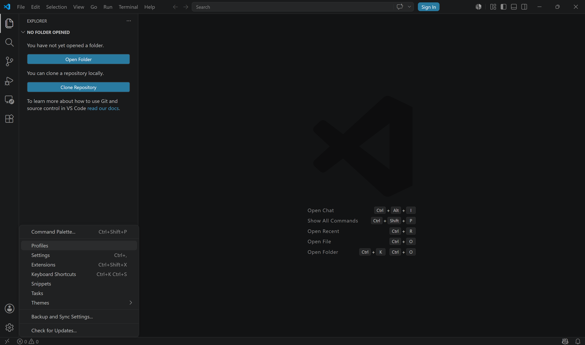
<figcaption aria-hidden="true">

VSCode profile settings
</figcaption>

</figure>

After the Profiles window has opened, click the arrow next to the *New
Profile* button and select *Import Profile…*.

<figure>

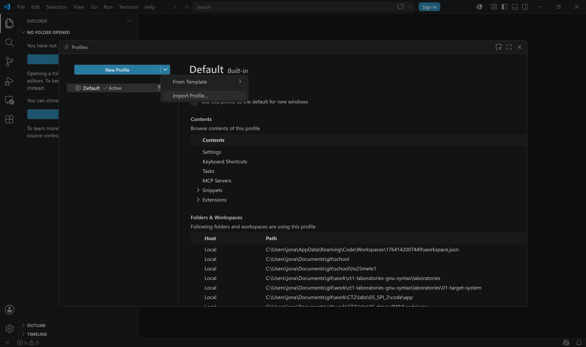
<figcaption aria-hidden="true">

VSCode profile import
</figcaption>

</figure>

Navigate to the local repository and select `../common/ct.code-profile`.

<figure>

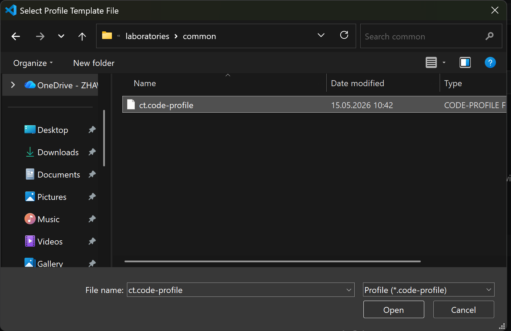
<figcaption aria-hidden="true">

VSCode profile path
</figcaption>

</figure>

Before creating the profile, make sure that the settings and extensions
from the CT profile are selected for import. The other options can be
chosen as needed.

<figure>

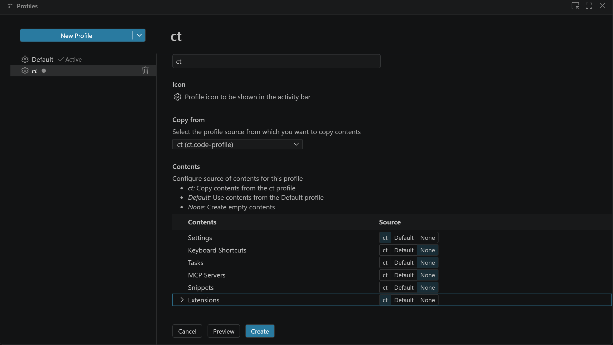
<figcaption aria-hidden="true">

VSCode profile create
</figcaption>

</figure>

After clicking *Create*, Visual Studio Code imports the selected
settings, such as the default terminal configuration, and installs the
required extensions.

Now activate the newly created profile by clicking on the checkmark that
appears when you hover the cursor over the name of the profile.

### ARM cross toolchain

To build software for the CT Board, you will need a cross-compiler
toolchain, the `arm-none-eabi toolchain`.

There are many ways to install the toolchain, choose one:

- [Install via ARMs installer package for
  MacOS](https://gitlab.arm.com/tooling/gnu-toolchains-for-arm).
  Download the package for MacOS hosted cross toolchains. Make sure to
  choose the MacOS package for `arm-none-eabi`.

  Run the installer package to install the cross-compiler toolchain in
  `/Applications`. The toolchain includes the compiler, linker, and
  debugger.

- Install via the [*Homebrew* package manager](https://brew.sh/). You
  need to install the toolchain, supporting applications and the
  debugger separately. Use the commands below:

  ``` sh
  brew install arm-none-eabi-gcc
  brew install arm-none-eabi-binutils
  brew install arm-none-eabi-gdb
  ```

- Install via the [*MacPorts* package
  manager](https://www.macports.org/). You need to install the
  toolchain, supporting applications and the debugger separately. Use
  the commands below:

  ``` sh
  sudo port install arm-none-eabi-gcc
  sudo port install arm-none-eabi-binutils
  sudo port install arm-none-eabi-gdb
  ```

### OpenOCD

`openocd` (Open On-Chip Debugger) is required for deploying and
debugging your software on the CT Board. On the Mac, OpenOCD can be
installed through `Homebrew` (`brew install open-ocd`) or `MacPorts`
(`sudo port install openocd`).

The usage of OpenOCD will be handled by scripts in the labs.

## Windows

When using Keil, follow the instructions on the [Wiki
(ennis)](https://ennis.zhaw.ch).

> Regardless of the setup you choose you will need to install a driver
> for the stlink, in order to detect the CT board. If you choose the
> Keil path, the installation instructions contain a section on
> installing the drivers too.
>
> If you choose the Makefile/VSCode route, you need just the driver,
> which you can download on
> [Wiki](https://ennis.zhaw.ch/wiki/doku.php?id=software:start:getting_started)
> for convenience, or on [STMs
> website](https://www.st.com/en/development-tools/stsw-link009.html) if
> the link is still valid.

### Installing MSYS2

MSYS2 (Minimal System 2) is a software distribution and a development
platform for Microsoft Windows, based on Mingw-w64 and Cygwin, that
allows to deploy code from the Unix world on Windows.

Download the installer from the [MSYS2 website](https://www.msys2.org/).

During installation, use the default installation directory `C:\msys64`.
Using a different installation directory may cause path-related issues
later.

<figure>

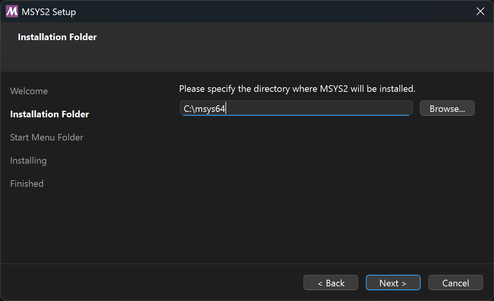
<figcaption aria-hidden="true">

Installation path of MSYS2
</figcaption>

</figure>

After the installation has completed, the checkbox to start MSYS2 can be
unchecked.

<figure>

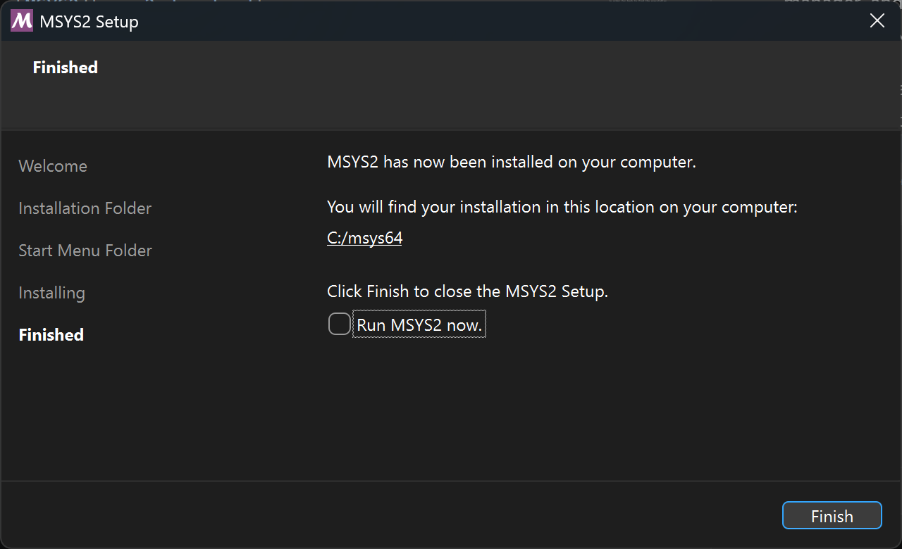
<figcaption aria-hidden="true">

Installation of MSYS2 finished
</figcaption>

</figure>

### Installing Visual Studio Code

> Installing VSCode is optional, you can also work in the terminal.
> However it does have a decent debugger integration, so it might be
> worth if you are not familiar with GDB and do not want to put in the
> effort to learn it.
>
> If you choose to use VSCode, be careful with extensions. There have
> been more supply chain attacks through VSCode extensions in just the
> past few month than i want to count.

Install [Visual Studio Code](https://code.visualstudio.com/) (if not
installed already).

After installing Visual Studio Code set up the provided profile
`../common/ct.code-profile`. Start Visual Studio Code, click the
settings button in the bottom-left corner, and select *Profiles*.

<figure>


<figcaption aria-hidden="true">

VSCode profile settings
</figcaption>

</figure>

After the Profiles window has opened, click the arrow next to the *New
Profile* button and select *Import Profile…*.

<figure>


<figcaption aria-hidden="true">

VSCode profile import
</figcaption>

</figure>

Navigate to the local repository and select `../common/ct.code-profile`.

<figure>


<figcaption aria-hidden="true">

VSCode profile path
</figcaption>

</figure>

Before creating the profile, make sure that the settings and extensions
from the CT profile are selected for import. The other options can be
chosen as needed.

<figure>


<figcaption aria-hidden="true">

VSCode profile create
</figcaption>

</figure>

After clicking *Create*, Visual Studio Code imports the selected
settings, such as the default terminal configuration, and installs the
required extensions.

Now activate the newly created profile.

### Installing tools via MSYS2

After Visual Studio Code has been configured, open the integrated
terminal with `Ctrl+Shift+!`. Visual Studio Code should automatically
open the MSYS2 UCRT64 terminal. Alternatively you can always use
`Ctrl+Shift+p` to open the fuzzy finder and search for terminal.

> **Note:** If a folder is opened in Visual Studio Code, the integrated
> terminal opens in that folder by default. For the MSYS2 setup, open
> the `laboratories` folder in Visual Studio Code.

If MSYS2 has been newly installed, a system upgrade needs to be
performed first. Run the command below:

``` sh
pacman -Syu
```

<figure>

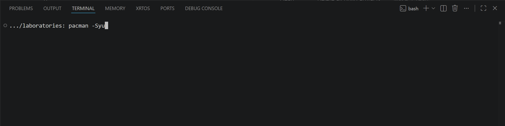
<figcaption aria-hidden="true">

MSYS2 system upgrade
</figcaption>

</figure>

If asked to proceed with the installation, accept. When no input is
given (just hitting enter) the capital option is used.

During the upgrade, `pacman` may ask to close the terminal to finish the
process. Accept again.

<figure>

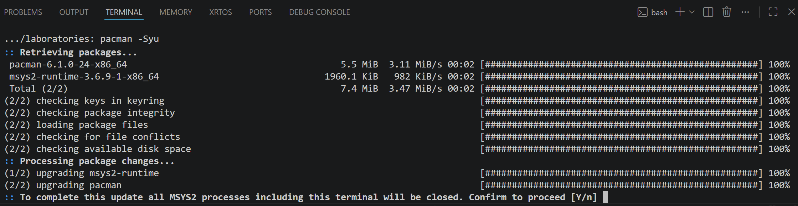
<figcaption aria-hidden="true">

MSYS2 terminal kill
</figcaption>

</figure>

After the terminal has closed, reopen it. To install the required tools,
a bash script is provided in `../common`.

Run the command below from the `laboratories` directory:

``` sh
../common/msys_init.sh
```

<figure>

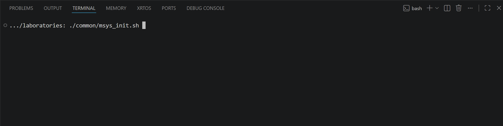
<figcaption aria-hidden="true">

MSYS2 bash script
</figcaption>

</figure>

After the installation has completed, compiling, flashing, and debugging
are ready to use.

### Git for Windows

The setup script for MSYS2 will install Git for the MSYS bash shell. If
you want fancy Git integration in VSCode you either need to figure out
the path setup, or install Git a second time via [Git for
Windows](https://git-scm.com/install/windows), below is a guide for the
latter.

The picture below shows the component selection with the required
options. Additional components can be selected if needed for other
purposes.

<figure>

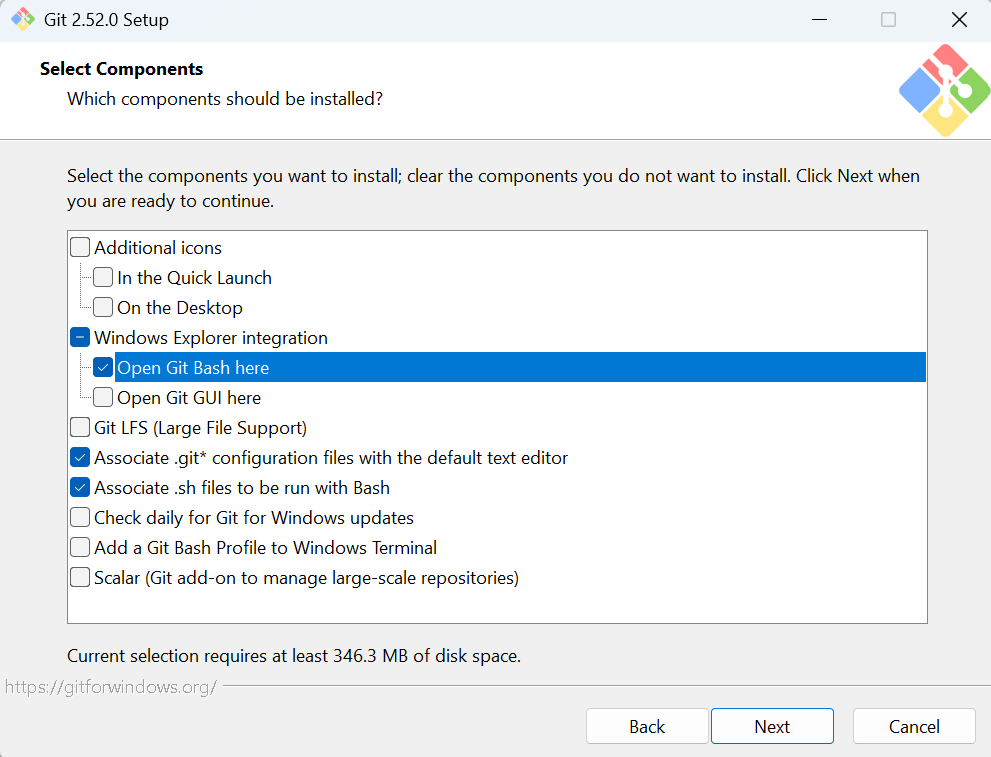
<figcaption aria-hidden="true">

components to install
</figcaption>

</figure>

An editor has to be selected during installation. Since Visual Studio
Code is already installed, it can be selected as the editor.
Alternatively, editors such as Vim can be used, the default is vi, which
might not even be installed.

<figure>

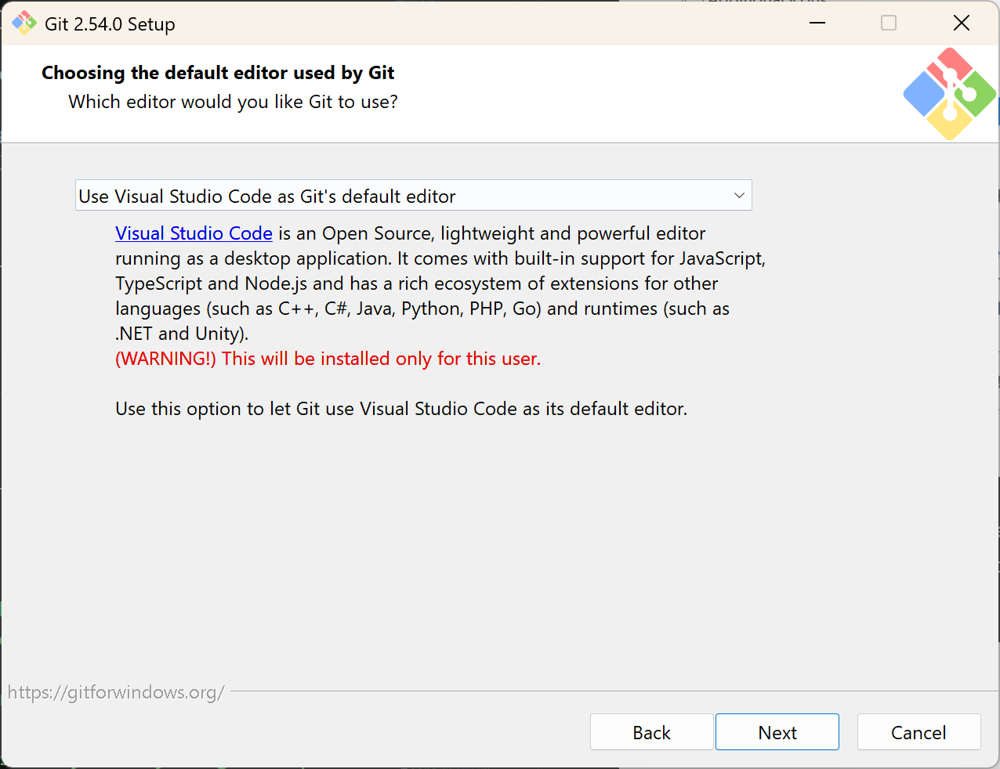
<figcaption aria-hidden="true">

git editor selection
</figcaption>

</figure>

If needed, Git Credential Manager can be enabled. When enabled, Git can
store login credentials, so they do not have to be entered every time a
push or pull requires authentication.

A common alternative is to use an SSH key with no password. This is not
recommended, but many developers do it anyways.

<figure>

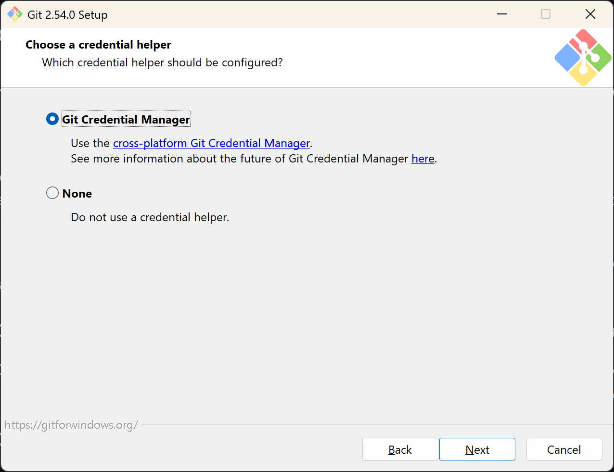
<figcaption aria-hidden="true">

git credentials option
</figcaption>

</figure>

# Testing setup

At this point the local repository should be setup, so `git` is working.

Since you probably used `git` in `bash`, it is probably installed
correctly too.

To test the toolchain and `openocd`, connect a CT board and build/flash
laboratory `02-bit-manipulations`.

# Workflow with Makefile

When working with the Makefile, one can edit the sources with the editor
of choice and compile, flash and debug with the make targets. The
following targets are defined:

| **target**   | **description**            | **command**        |
|:-------------|:---------------------------|:-------------------|
| default, all | incremental build          | `make`, `make all` |
| clean        | delete all build artifacts | `make clean`       |
| rebuild      | clean build                | `make rebuild`     |
| flash        | flash binary to the board  | `make flash`       |
| dbgsrv       | start debug server         | `make dbgsrv`      |
| launchgdb    | start debugger             | `make launchgdb`   |

> *Note:* In order to use the makefile one needs to navigate to the
> makefiles directory.

## Debugging with `GDB`

To debug with GDB you first need to start the debug server. We use
`openocd` to host a local debug server for a remote target. It can be
started with the Make target `dbgsrv`. Next launch the client in a
separate shell instance with the Make target `launchgdb`, this will open
GDB as interactive command line interface.

<figure>

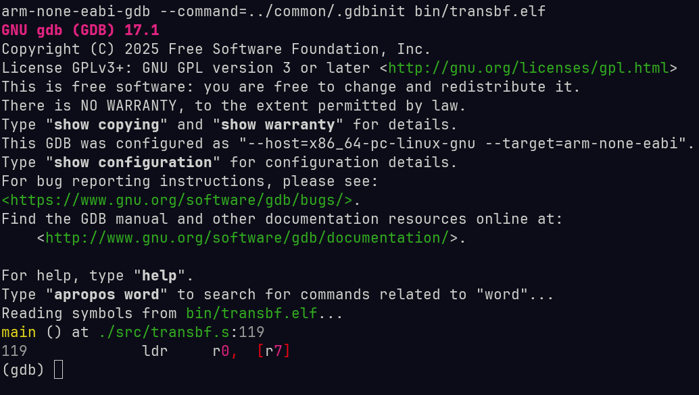
<figcaption aria-hidden="true">

freshly opened GDB
</figcaption>

</figure>

The CLI is used to interact with GDB, with the `layout` command you can
enable for example the `src` window, which displays the source code.
When enabling a **layout** usually the focus is on one of the new
windows, which may lead to unexpected behaviour of keys like the arrows.
To change **focus** to another window, use the
`focus [asm|cmd|regs|src]` command.

| **Window** | **Description** |
|:---|:---|
| `asm` | shows the disassembly of the program |
| `cmd` | interactive window used to control GDB, but also print output of commands like `info`, `print`, `x` |
| `regs` | shows the contents of the processors register |
| `src` | displays source code, by default at the point of execution |

> *NOTE:* For the labs the custom layout `ines` is provided. It is
> defined in `../common/.gdbinit`.

<figure>

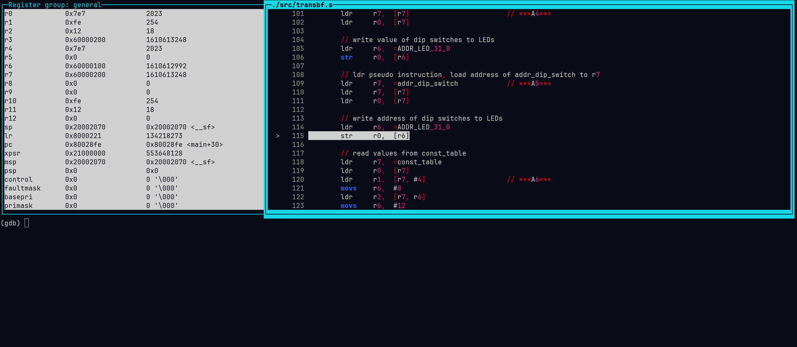
<figcaption aria-hidden="true">

GDB layout <code>ines</code>
</figcaption>

</figure>

> *NOTE:* GDB supports completions with `tab`.

You can exit GDB using the command `quit`.

To set **breakpoints** use `breakpoint <position>` or just
`b <position>`. See the table on the position argument below for details
on how to specify the position for a breakpoint. Use `info breakpoints`
to list all breakpoints. Delete breakpoints with
`delete <breakpoint-number>`.

To **continue** normal execution after a reset, or breakpoint use
`continue` (or just `c`). `step`, `next` and `finish` are the
equivalents to **step** in/over/out.

- *Step in* executes just one instruction (or line in case of a higher
  level language), it enters functions if encountered.
- *Step over* executes the next instruction, does not enter functions.
- *Step out* executes instructions until the current function returns.

Use `x` (examine) to **view memory** contents.

    # synopsis
    x[/format] <address>

    # example without format
    x 0x20000000

    # example with format
    # prints 4 bytes starting at 0x2000_0000 in hexadecimal format
    x/4xb 0x20000000

    # format:
    # x/nfs
    #
    # n = number of elements to print
    #
    # f = format to print:
    #       o = octal
    #       x = hexadecimal
    #       d = decimal
    #       u = unsigned decimal
    #       t = binary
    #       f = float
    #       a = address
    #       i = instruction
    #       c = char
    #       s = string
    #       z = hex, zero padded on the left
    #
    # s = size of one element:
    #       b = byte (8 bits)
    #       h = halfword (16 bits)
    #       w = word (32 bits)
    #       g = giant (64 bits)

| **position**    | **description**                      |
|:----------------|:-------------------------------------|
| `<symbol-name>` | name of a symbol, e.g. function name |
| `<line>`        | line number (in current file)        |
| `<file>:<line>` | line number in the specified file    |

# Workflow with Visual Studio Code

When working with Visual Studio Code, make sure to add only the current
lab directory to the workspace, not the directory containing all labs.
Otherwise, Visual Studio Code might not detect the Makefile correctly.

To compile or flash the program, use Visual Studio Code’s task system.
Tasks can be launched by pressing `Ctrl+Shift+B` and selecting the
desired task.

> *Note:* When multiple labs are open in the workspace, make sure to run
> the task for the lab currently being worked on.

> *Note:* There is a Vim extension for Visual Studio Code, which can
> make editing more comfortable for Vim users taking advantage of
> VSCodes debugger integration.

## Debugging with Visual Studio Code

To start the debugger, open the debugging view by clicking the debug
icon or by pressing `Ctrl+Shift+D`. Select the desired target next to
the green play button, then press the play button or `F5`.

<figure>

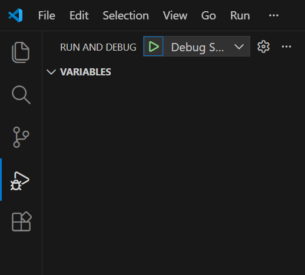
<figcaption aria-hidden="true">

Debug Window
</figcaption>

</figure>

> *Note:* Registers and variables are only updated when the program is
> paused.

<!-- links -->
