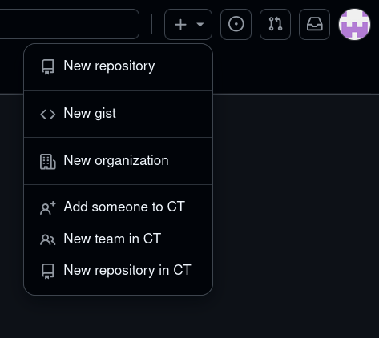
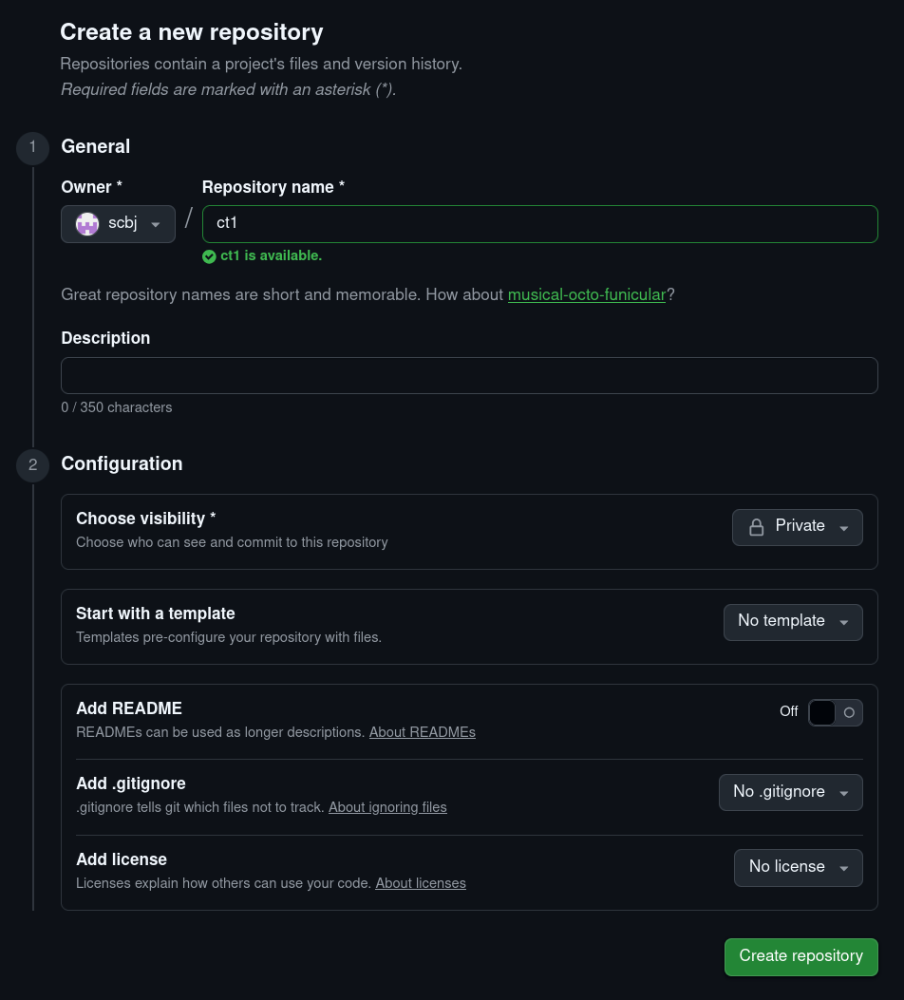
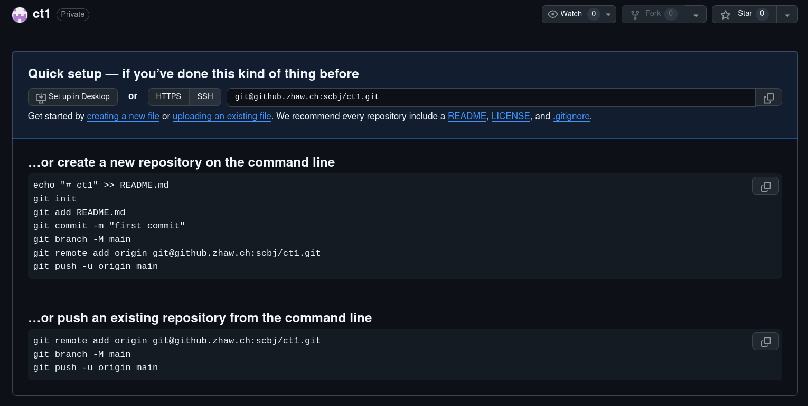

# CT1: Computer engineering

This repository contains the lectures, exercises and laboratories for
computer engineering 1.

**Do not fork this repository.**  
See chapter [Setting up a private
repository](#setting-up-a-private-repository) for instructions on how to
get a private copy of the repository.

<!--toc:start-->

- [CT1: Computer engineering](#ct1-computer-engineering)
  - [Terminology](#terminology)
  - [Setting up a private repository](#setting-up-a-private-repository)
  - [File structure](#file-structure) <!--toc:end-->

## Terminology

- Path are relative whenever applicable.
- Values in angle brackets (`<>`) are usually placeholders for
  setupspecific parameters.

## Setting up a private repository

It is sensible to work with Git and have a private copy of this
repository.

However if you fork it on Github, students after you will have trouble
finding the right repository searching for `ct`. Also they will have
your solutions, though experience shows, they will have access to
solutions anyways. (It is usually rather easy to spot.)

Thus you shall not use Githubs `fork` function. Instead follow the steps
below.

1)  Clone the CT1 repository locally. Read `git-introduction.(md|pdf)`
    if you do not know how to use Git.

2)  Create an empty and **private** repository with your user as owner.

    <figure>
    
    <figcaption aria-hidden="true">Creating a new repository</figcaption>
    </figure>

    <figure>
    
    <figcaption aria-hidden="true">Settings for new repository</figcaption>
    </figure>

    Make sure to select your **user as owner**. Choose a recognisable
    name for you new repository. The description is optional.

    > As mentioned before: Set the visibility to **Private**.

3)  Change the URL of your local copy of the CT1 repository.

    <figure>
    
    <figcaption aria-hidden="true">Newly created empty
    repository</figcaption>
    </figure>

    Copy the URL in the ‘Quick setup’ box. In your local copy of the CT1
    repository set the remote URL to your empty repository.

    ``` sh
    cd <path/to/ct1/repository>
    git remote set-url origin <url-to-private-repository>
    ```

4)  In order to get updates, set up a second remote for your local copy,
    called upstream with the URL of the provided repository.

    ``` sh
    # synopsis: git remote add <remote-name> <remote-url>
    git remote add upstream git@github.zhaw.ch:CT/ct1-students.git
    ```

    To get updates, you can now use `git pull upstream main`. This will
    cause conflicts, generally you can choose your own changes on any
    laboratory you have already solved, and choose the upstream change
    on all others.

5)  **Optionally** if you work on the labs with a fellow student, you
    can open the settings of your private repository and add them as
    collaborator in order to give them access.

## File structure

Below is the file tree of the students repository for CT1. It only shows
files which are mentioned in this document.

Entries ending with ‘/’ are directories.

    ct1-students
    +-- common/
    |   +-- .gdbinit
    |   +-- ct.code-profile
    |   +-- pdf.mk
    |   +-- root.mk
    |   +-- template.tex
    |   `-- trailing-whitespace.sh
    +-- exercises/
    +-- git-introduction/
    |   +-- Makefile
    |   +-- readme.md
    |   `-- readme.pdf
    +-- laboratories/
    |   +-- Makefile
    |   +-- readme.md
    |   `-- readme.pdf
    +-- libctboard/
    +-- theory/
    +-- Makefile
    +-- readme.md
    `-- readme.pdf

Every Markdown file should have a `Makefile` with rules to convert from
Markdown to PDF (requires `pandoc` and `texlive`). The students releases
should contain a PDF version of every Markdown file.

`./readme.(md|pdf)` is the file you are reading. It contains a file tree
and instructions on “forking” without forking.

`./laboratories/readme.(md|pdf)` contains instructions on how to setup
the required tools for the laboratories, how to work with the makefiles,
VS Code or Keil and a short introduction to the GNU debuger.

`./common/.gdbinit` contains commands to be run by the GNU debugger at
startup. For example if you want to modify the `ines` layout you could
change this file.

`./common/ct.code-profile` is a profile for VS Code users, which comes
with the required extensions and settings.

`./common/pdf.mk` is a make include file with rules to convert Markdown
to PDF.

`./common/root.mk` is a make include file with rules to build and link
binaries from C and assembly sources.

`./common/template.tex` is a LaTeX template for pandoc to customise the
PDF output of pandoc.

`./common/trailing-whitespace.sh` is a bash script to detect and remove
trailing whitespace and optionally convert line endings to unix style
(lf).

`./git-introduction/readme.(md|pdf)` is a short introduction to Git. It
is mostly intended for beginners, but also discusses some more advanced
topics.
